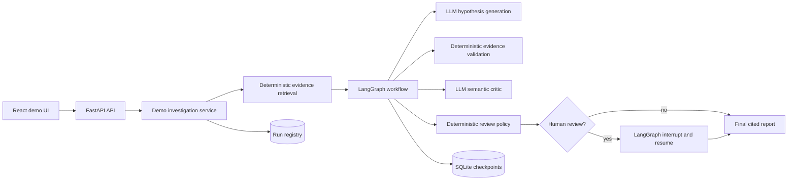

# Telemetry Investigation Agents

Telemetry Investigation Agents is a Python + LangGraph portfolio project for
investigating synthetic telemetry incidents with evidence-backed AI assistance.

The project demonstrates a controlled workflow rather than a chatbot: ordinary
Python code retrieves evidence, validates citations, applies review policy, and
assembles reports; bounded LLM calls propose and critique structured hypotheses.

The portfolio thesis is simple: AI-assisted incident investigation becomes more
credible when the workflow can show which evidence was used, which claims were
validated, when uncertainty remains, and when a human should review the result.

## Portfolio Snapshot

- LangGraph workflow with typed state, checkpointing, interrupts, and resume.
- Deterministic parsing, retrieval, evidence scoring, validation, and routing.
- Azure OpenAI adapters behind small provider boundaries.
- FastAPI API and React/Vite demo UI over DTOs, not raw graph state.
- Evaluation suite covering evidence coverage, category behavior, human-review
  routing, citation correctness, and unsupported claims.
- Structured JSON events and optional OpenTelemetry console spans for debugging.

## Problem Statement

Incident investigation often mixes logs, traces, metrics, partial context, and
pressure to produce a clear answer. A generic chatbot over telemetry can produce
plausible explanations, but it is hard to verify which evidence was used, where
claims came from, and when the system should stop and ask for human review.

This project demonstrates a safer pattern:

- retrieve and score telemetry evidence deterministically;
- preserve evidence IDs and citations;
- let the LLM generate structured candidate hypotheses only from supplied
  evidence;
- validate cited evidence before a hypothesis can be used;
- use a critic and deterministic review policy for semantic risk;
- require human review when evidence is weak, missing, conflicting, disputed, or
  insufficient;
- evaluate the workflow against known synthetic cases.

## What To Review First

1. [Architecture](docs/architecture.md) for the system shape, module
   boundaries, state model, persistence, and review flow.
2. [Architecture diagrams](docs/diagrams/architecture-overview.mmd) for the
   editable C4-style overview. The detailed runtime and graph diagrams live in
   [docs/diagrams](docs/diagrams).
3. [Agent responsibilities](docs/agent-responsibilities.md) for what each
   workflow step does, what is LLM-backed, and what is verified
   deterministically.
4. [AI workflow design](docs/ai-workflow-design.md) for the core design
   principle: deterministic Python owns evidence and policy; bounded LLM calls
   propose and critique structured hypotheses.
5. [Evaluation](docs/evaluation.md) and the
   [latest Azure eval report](docs/evaluation/2026-06-26-azure-eval-report.md)
   for the scorecard, cases, and captured `4/4 passed` provider-backed run.
6. [ADR index](docs/adr/index.md) for the design decisions behind evidence
   retrieval, validation, checkpointing, evaluation, and semantic review.

## What This Demonstrates

- LangGraph orchestration with explicit typed workflow state.
- Deterministic telemetry parsing, matching, evidence scoring, and citations.
- Bounded LLM reasoning through adapter protocols and structured outputs.
- Deterministic validation of evidence references and confidence caps.
- Semantic critique separated from deterministic review policy.
- Human-in-the-loop routing using LangGraph interrupts and checkpointing.
- FastAPI boundary that exposes UI-oriented DTOs, not raw graph state.
- Thin React/Vite demo UI for presenting investigation outcomes.
- Evaluation cases that test evidence coverage, category behavior, review
  routing, citation correctness, and unsupported-claim checks.
- Structured logs and optional OpenTelemetry console spans for traceability.

## Boundaries

- Not a production observability product.
- Not connected to real log, trace, or metric platforms.
- Not a fully automated root-cause analysis system.
- Not an incident ingestion portal.
- Not a replacement for engineers.
- Not claiming production readiness, auth, RBAC, deployment, cost controls, or
  real telemetry ingestion.
- Not a broad benchmark of model quality.

Synthetic telemetry is deliberate: it keeps the portfolio focused on workflow
design, evidence boundaries, evaluation, and review policy rather than vendor
integration.

## Architecture Overview



The graph starts after deterministic evidence retrieval. The current workflow is:

```text
hypothesis_generation
    -> hypothesis_validation
    -> hypothesis_critic
    -> hypothesis_review
    -> human_review_assessment
    -> report_review_gate or final_report_builder
    -> report_ready_marker or report_rejected_marker
```

See [docs/architecture.md](docs/architecture.md) for the current architecture.
Editable diagram sources:

- [C4-style container overview](docs/diagrams/architecture-overview.mmd)
- [Investigation runtime flow](docs/diagrams/investigation-runtime-flow.mmd)
- [LangGraph workflow internals](docs/diagrams/langgraph-workflow.mmd)

## Deterministic vs LLM Responsibilities

Deterministic Python owns:

- local synthetic telemetry parsing;
- time-window, severity, query-term, and trace-ID matching;
- one-hop trace-ID expansion from relevant logs;
- evidence IDs, citations, strength, and relevance scores;
- rejection of unknown or missing evidence references;
- confidence caps based on evidence strength;
- review routing rules;
- report assembly from accepted hypotheses;
- API DTO mapping, checkpointing, run registry, and eval scoring.

The LLM boundary is intentionally smaller:

- propose structured candidate hypotheses from the incident and retrieved
  evidence;
- cite supplied evidence IDs;
- state uncertainty for low-confidence hypotheses;
- critique validated hypotheses for semantic issues such as contradictions,
  unsupported causal leaps, alternative interpretations, or overstated
  confidence.

Raw generated hypotheses are candidate state. Downstream reporting relies on
validated and reviewed hypotheses.

Provider prompt contracts live as packaged Markdown files under
`src/telemetry_agents/infrastructure/prompts/`. The Azure OpenAI adapters load
those files and send them as system messages, while deterministic Python code
still owns validation, confidence policy, review routing, and evaluation.

## Evidence, Validation, And Review

Every retrieved evidence item has:

- an evidence ID such as `log-checkout-api-12`;
- source type: log, trace, or metric;
- source file and line number when available;
- selection reason;
- evidence strength: strong, medium, weak, or missing.

The validator prevents common failure modes:

- hypotheses without citations are rejected;
- unknown evidence IDs are rejected;
- missing evidence cannot support a hypothesis;
- confidence is capped when cited evidence is not strong enough;
- validation decisions are recorded in structured result objects.

Human review is triggered by deterministic policy when risk remains: high-impact
incidents, weak or missing evidence, no validated hypothesis, a top accepted
uncertain or insufficient-evidence outcome, disputed or blocked top hypotheses,
close blocked alternatives, warnings, or conflicting explanations without a
dominant accepted hypothesis.

## Demo And Evaluation Cases

The repo includes four synthetic cases under `eval_data/`:

| Case | Expected behavior |
|---|---|
| `checkout-database-timeout` | High-confidence database failure; no human review expected. |
| `downstream-dependency-latency` | High-confidence downstream dependency failure; no human review expected. |
| `conflicting-evidence` | Uncertain root cause; human review expected. |
| `insufficient-evidence` | Insufficient evidence; human review expected. |

See [docs/evaluation.md](docs/evaluation.md) for the scorecard and case details.
A sample successful report is captured in
[docs/sample-output/checkout-database-timeout-report.md](docs/sample-output/checkout-database-timeout-report.md).

## Verification Snapshot

Current captured verification artifacts:

- Offline test suite: `uv run pytest`
- Azure provider eval: `uv run telemetry-evals --provider azure`
- Captured result:
  [docs/evaluation/2026-06-26-azure-eval-report.md](docs/evaluation/2026-06-26-azure-eval-report.md)

The Azure eval report is a regression snapshot, not a production benchmark.
Provider-backed behavior can vary across model versions, deployments, and
configuration.

## Tech Stack

- Python 3.12
- LangGraph
- FastAPI
- Pydantic
- SQLite checkpointing and run registry
- LLM provider adapter implementation behind provider protocols
- OpenTelemetry API/SDK for optional local tracing
- pytest, ruff, mypy
- React, TypeScript, Vite

## Local Setup

Install Python dependencies:

```powershell
uv sync
```

Create local configuration:

```powershell
Copy-Item .env.example .env
```

The default `.env.example` uses deterministic local demo mode:

```text
TELEMETRY_AGENTS_DEMO_PROVIDER=fake
```

This mode runs the real retrieval, graph, validation, review, checkpointing, API,
and UI path without live model calls.

## Quick Demo Path

1. Start the backend:

```powershell
uv run uvicorn telemetry_agents.api.app:app --reload
```

2. Start the frontend in a second terminal:

```powershell
cd frontend
npm install
npm run dev
```

3. Open:

```text
http://127.0.0.1:5173
```

4. Run `checkout-database-timeout` first to show the happy path, then run
   `conflicting-evidence` or `insufficient-evidence` to show review escalation.

## Run The Backend

```powershell
uv run uvicorn telemetry_agents.api.app:app --reload
```

Backend URL:

```text
http://127.0.0.1:8000
```

Useful endpoints:

```powershell
curl http://127.0.0.1:8000/health
curl http://127.0.0.1:8000/api/v1/demo-cases
curl http://127.0.0.1:8000/api/v1/investigations
```

Start an investigation:

```powershell
curl -X POST http://127.0.0.1:8000/api/v1/investigations `
  -H "Content-Type: application/json" `
  -d '{"case_id":"checkout-database-timeout"}'
```

Read a run:

```powershell
curl http://127.0.0.1:8000/api/v1/investigations/<run_id>
```

Submit human review for a run awaiting review:

```powershell
curl -X POST http://127.0.0.1:8000/api/v1/investigations/<run_id>/review `
  -H "Content-Type: application/json" `
  -d '{"approved":true}'
```

Reset local SQLite demo state:

```powershell
uv run telemetry-demo-reset
```

## Run The Frontend

In a second terminal:

```powershell
cd frontend
npm install
npm run dev
```

Frontend URL:

```text
http://127.0.0.1:5173
```

The Vite dev server proxies `/api` calls to `http://127.0.0.1:8000`.

## Run Tests And Evals

Default offline verification:

```powershell
uv run pytest
```

Frontend verification:

```powershell
cd frontend
npm run build
```

Live evaluation uses the provider implementation and is documented in
[docs/evaluation.md](docs/evaluation.md). In short, it requires configured
provider access and runs:

```powershell
uv run telemetry-evals --provider azure
```

That command prints the compact pass/fail scorecard. Add `--show-telemetry` when
you want structured JSON events during the run:

```powershell
uv run telemetry-evals --provider azure --show-telemetry
```

## Limitations

- Telemetry data is synthetic and local.
- The React UI is a presentation/demo layer, not a full product.
- The API supports predefined demo cases, not arbitrary incident ingestion.
- Evaluation currently covers four scenarios.
- No holdout eval set exists yet.
- Live provider evals are probabilistic and can vary across deployments.
- The local fake provider is deterministic and exists for repeatable demos.
- Production concerns such as auth, RBAC, deployment, multi-tenant isolation,
  cost controls, streaming execution, queue workers, real observability
  integrations, and real telemetry ingestion are intentionally out of scope.

## Future Improvements

- Add screenshots or a short recorded demo.
- Add holdout eval cases that are not used during prompt or policy iteration.
- Add more eval cases, including deployment/configuration evidence.
- Add richer metric anomaly logic and baseline comparison.
- Add a real telemetry adapter behind the existing evidence retrieval boundary.
- Add background execution and polling/WebSocket updates for longer runs.
- Add production-grade auth, deployment, monitoring, and cost controls if the
  project were evolved beyond portfolio scope.
