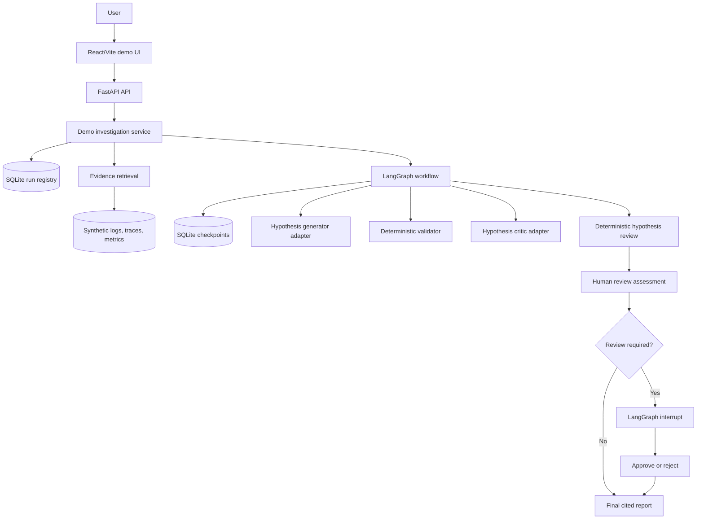

# Architecture

## System Overview

Telemetry Investigation Agents is a controlled investigation workflow over
synthetic telemetry. The system is organized around a simple rule: deterministic
code owns evidence handling and workflow policy; bounded LLM calls propose and
critique structured hypotheses.



The UI and API are presentation boundaries. They do not expose raw LangGraph
state. They use DTOs that summarize run status, incident metadata, hypotheses,
evidence citations, review reasons, and final report state.

The standalone editable Mermaid source for the system diagram is stored at
[docs/diagrams/architecture-overview.mmd](diagrams/architecture-overview.mmd).

## Backend Components

`telemetry_agents.telemetry`

Parses local synthetic logs, traces, and metrics. It owns the file formats and
returns parsed records with source location metadata.

`telemetry_agents.investigation`

Owns deterministic investigation behavior:

- log, trace, and metric matching;
- evidence scoring;
- citation assembly;
- hypothesis validation;
- hypothesis review policy;
- human review assessment;
- report building.

It also defines small provider protocols for hypothesis generation and semantic
critique. These boundaries make the workflow testable without a live LLM.

`telemetry_agents.graph`

Owns LangGraph state, node wrappers, routing, interrupts, and workflow
composition. Graph nodes call application functions; they do not parse telemetry
or hide evidence policy.

`telemetry_agents.app`

Composes demo services for local deterministic mode and provider-backed mode.
It loads demo incidents, retrieves evidence before graph execution, invokes or
resumes the workflow, and maps workflow state to application results.

`telemetry_agents.api`

Exposes FastAPI routes and response DTOs for the demo UI.

`telemetry_agents.infrastructure`

Contains external adapter implementations: SQLite checkpointing/run registry and
the Azure OpenAI provider adapters.

`telemetry_agents.evaluation`

Scores workflow outputs against golden synthetic cases.

## LangGraph Workflow

The current graph begins after evidence retrieval. That is intentional:
retrieval is deterministic application logic, while LangGraph coordinates the
stateful reasoning and review workflow.

```text
START
  -> hypothesis_generation
  -> hypothesis_validation
  -> hypothesis_critic
  -> hypothesis_review
  -> human_review_assessment
  -> conditional route
       -> human_review_not_required_marker
       -> final_report_builder
       -> report_ready_marker
       -> END
    or
       -> report_review_gate
       -> final_report_builder or report_rejected_marker
       -> report_ready_marker or END
```

The review gate uses a LangGraph interrupt. A run that requires review can be
resumed with `Command(resume={"approved": true})` or rejected with
`Command(resume={"approved": false})`.

## State Model

The graph state is a `TypedDict` named `InvestigationGraphState`. It contains
workflow context, not domain behavior:

- `run_id`
- `normalized_incident`
- `collected_evidence`
- `hypotheses`
- `validation_result`
- `critique_findings`
- `review_result`
- `human_review_assessment`
- `human_review_status`
- `report_ready`
- `final_report`
- `warnings`
- `errors`

Domain models are Pydantic models such as `Incident`, `TelemetryEvidence`,
`InvestigationHypothesis`, `HypothesisValidationResult`,
`ReviewedHypothesis`, `HumanReviewAssessment`, and `InvestigationReport`.

The state is explicit so a reviewer can see what each workflow step consumes and
produces.

## Evidence Flow

Evidence retrieval is deterministic:

```text
local telemetry files
  -> LocalFileTelemetryReader
  -> parsed source records
  -> source-specific matching
  -> RetrievedEvidence with IDs and citations
  -> ranked evidence list
```

Each evidence item includes:

- evidence ID;
- source type;
- summary;
- source file and line number when available;
- timestamp when available;
- service;
- selection reason;
- strength;
- relevance score.

Retrieval uses service, incident window, query terms, severity, request trace ID,
and bounded one-hop trace-ID expansion from selected logs. Missing source files
or empty matches are represented as missing evidence instead of forcing a
confident answer.

## LLM Boundary

The provider boundary is deliberately narrow.

The hypothesis generator receives the incident and retrieved evidence and returns
structured candidate `InvestigationHypothesis` objects. It must cite supplied
evidence IDs and provide uncertainty for low-confidence hypotheses.

The semantic critic receives validated hypotheses and evidence, then returns
structured critique findings. It does not rewrite hypotheses, choose routes, or
produce the final report.

Provider-backed mode currently has Azure OpenAI adapter implementations. The
architecture is described more generally as an LLM provider boundary because the
graph and application logic do not depend on provider-specific SDKs.

The provider prompt contracts are stored as packaged Markdown resources in
`src/telemetry_agents/infrastructure/prompts/` and loaded by the Azure OpenAI
adapters at call time. Keeping prompts outside adapter method bodies makes the
model instructions easier to review, while the deterministic policy remains in
Python code and tests.

## Validation And Review Rules

Validation owns the evidence trust boundary:

- hypotheses without supporting evidence IDs are rejected;
- unknown evidence IDs are rejected;
- missing evidence cannot support a hypothesis;
- confidence is capped according to evidence strength;
- rejections and confidence adjustments are recorded.

Semantic critique findings are mapped by deterministic policy:

- contradictions and unsupported causal leaps become `blocked`;
- alternative interpretations and overstated confidence become `disputed`;
- no findings becomes `accepted`.

Human review is triggered when the reviewed output is risky, including:

- high incident impact;
- weak or missing evidence;
- no validated hypotheses;
- top accepted insufficient-evidence or uncertain-root-cause hypotheses;
- top reviewed hypothesis is blocked or disputed;
- no accepted hypothesis exists;
- multiple disputed hypotheses without a dominant accepted hypothesis;
- a blocked hypothesis close to the top accepted hypothesis;
- warnings.

The LLM does not directly control routing. It emits structured critique findings;
deterministic code decides whether review is required.

## API And UI Relationship

The FastAPI API exposes demo-oriented endpoints:

- `GET /health`
- `GET /api/v1/demo-cases`
- `POST /api/v1/investigations`
- `GET /api/v1/investigations`
- `GET /api/v1/investigations/{run_id}`
- `POST /api/v1/investigations/{run_id}/review`

The React UI depends only on these DTOs. It can list demo cases, start a run,
load run history, inspect evidence and hypotheses, and approve or reject runs
that are awaiting human review.

## Persistence

Two SQLite-backed persistence mechanisms are used locally:

- LangGraph checkpoints store workflow state by thread/run ID.
- The application run registry stores run metadata such as case ID, incident ID,
  provider, and run status.

The run registry is not a replacement for LangGraph checkpoints. It is an
application read model for the API and UI.

## Why The Design Is Intentionally Controlled

This project avoids the common failure mode where the LLM receives raw telemetry
and returns a polished but hard-to-audit answer. The controlled design creates
clear accountability:

- deterministic code says what evidence exists;
- the LLM proposes possible interpretations;
- validation decides whether citations are usable;
- review policy decides whether automation can continue;
- final reports cite accepted evidence.

That structure is the main portfolio signal: production-minded AI workflow
engineering rather than a chatbot-style demo.

## Deliberate Limits

- Synthetic local telemetry only.
- No real observability platform integration.
- No arbitrary incident ingestion.
- No background worker or streaming execution.
- No authentication or authorization.
- No deployment configuration.
- Limited evaluation scenario count.
- Metric evidence is intentionally conservative until richer anomaly detection
  exists.
